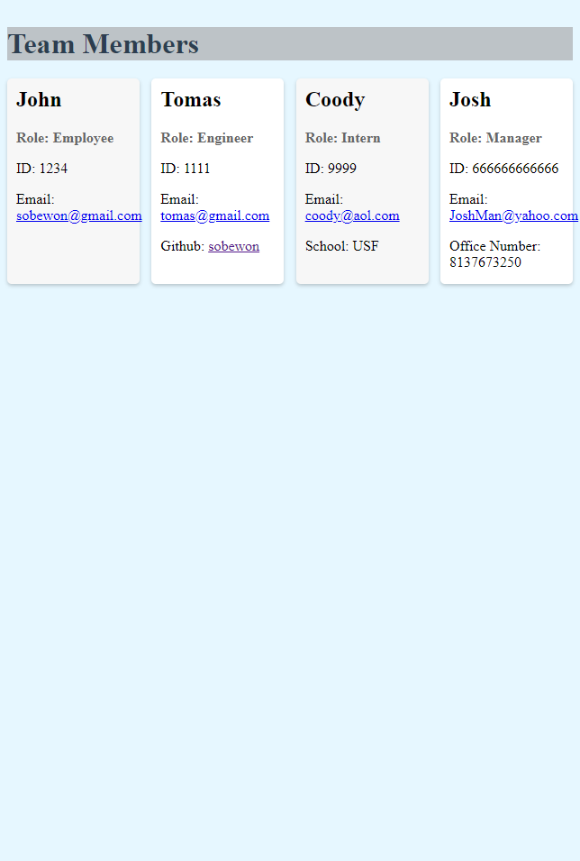

# TeamProfileGen

A Node.js command-line application that takes in information about employees on a software engineering team and generates an HTML webpage that displays summaries for each person.

## Reason for Creation

I wanted to create an easier way for myself and others to see who is on my team, some basic info about them, and how to contact them.

## How to use
- clone the repo
- install dependencies (run 'npm i' in terminal)
- in terminal run "node index.js"
- make selection
- input information
- when finished select 'exit' from the choices
- The index.html file will be created within the /dist folder
- open it in your browser and see your information now displayed in a nice, readable way.

## Screenshot of test example

This example is from the test found in the video.

## Test Video 

https://youtu.be/1W2L6deCAA8

## GitHub Repo

https://github.com/sobewon/TeamProfileGen

## Thank you for viewing my project!

